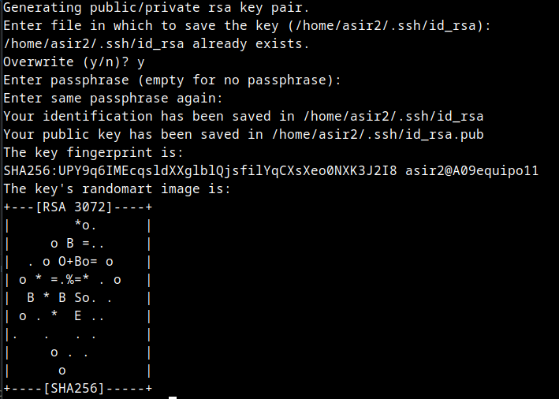
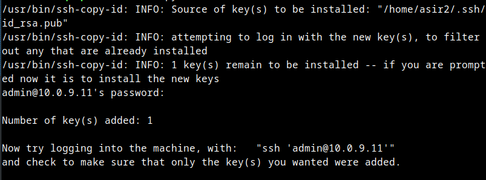
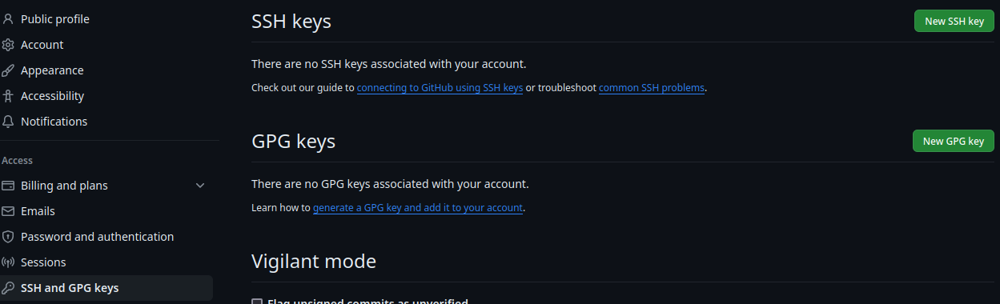
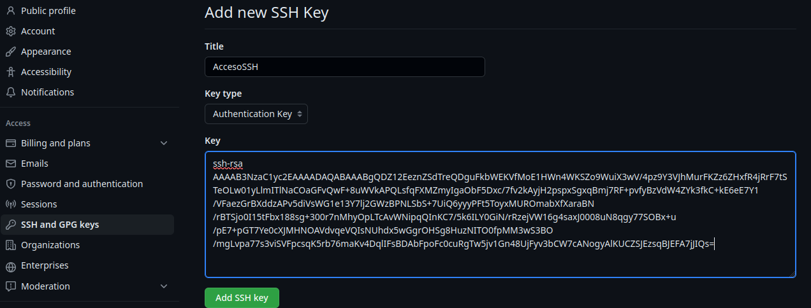
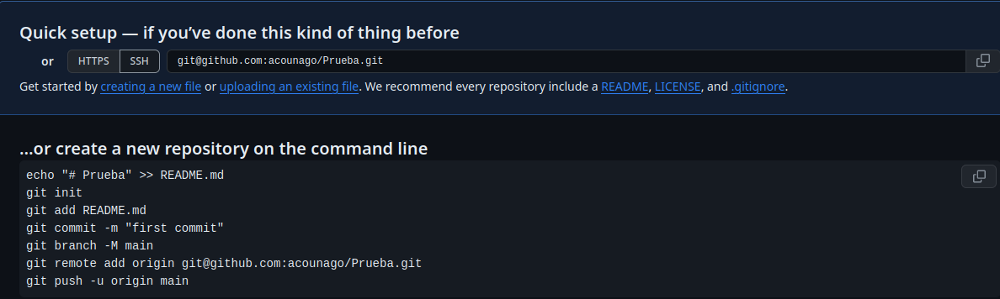

# 1 Acceso SSH
## Para realizar una conexión SSH en este caso con un host cuya IP es 10.0.9.10 debemos seguir los siguientes pasos:

### Desde la máquina destino(10.0.9.10) debemos realizar los siguientes comandos
***Generamos la clave publica/privada***
  
    ssh-keygen 

***Una vez generada la clave se la asignamos al usuario a nuestra elección. En nuestro caso se la asignaremos al usuario admin(10.0.0.11) con el siguiente comando***

    ssh-copy-id admin@10.0.9.11

## Ahora desde la máquina origen(10.0.9.11) deberiamos poder establecer conexión sin necesidad de contraseña a la máquina destino(10.0.9.10)
***Para realizar la conexión utilizamos el siguiente comando***

    ssh admin@10.0.9.11

# 2 Configurar el acceso ssh en el GitHub 

## a) Accedemos a los ajustes en nuestro perfil de GitHub y en el apartado *SSH and GPG Keys* seleccionamos la opción *New SSH Key*

***Una vez dentro asignamos un nombre a nuestra llave y pegamos el contenido de la misma y seleccionamos ***Add new key***

## b) Cuando creemos un repositorio seleccionamos la opción ***SSH***

